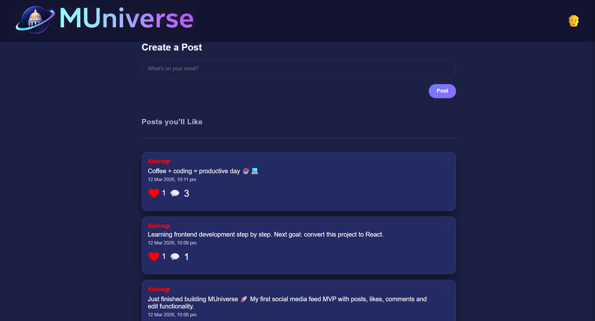
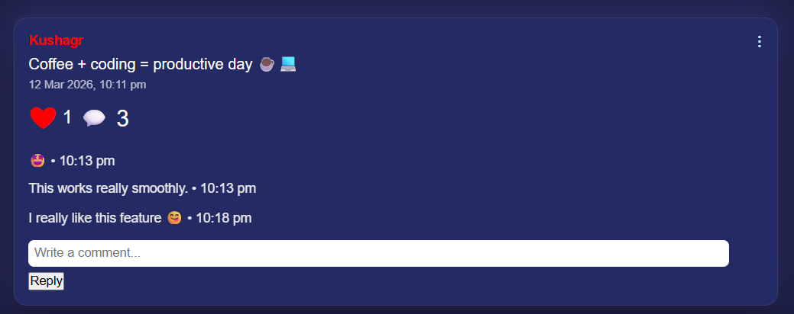
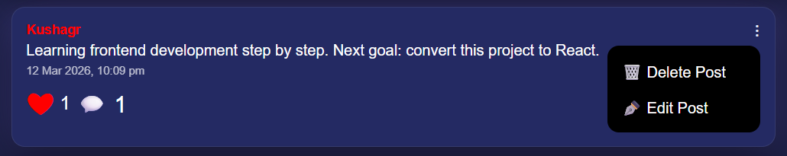

# MUniverse

A social media feed MVP built with HTML, CSS and JavaScript.

## Features
• Create posts  
• Edit and delete posts  
• Like system with animation  
• Comment system  
• Username per user (stored in localStorage)  
• Post timestamps  
• Dropdown menu actions  
• LocalStorage persistence  

## Tech Stack
HTML  
CSS  
JavaScript 

## Future Improvements
• React conversion  
• Backend API  
• Database storage

## Screenshots

### Feed

### Comment System

### Post Actions

